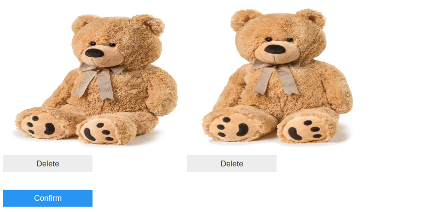
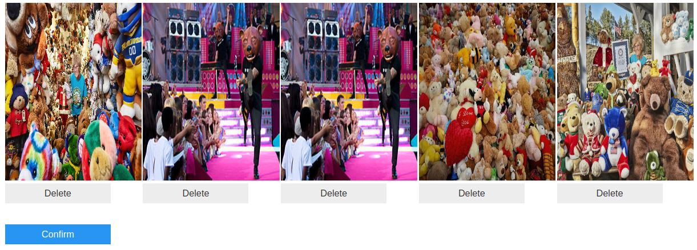
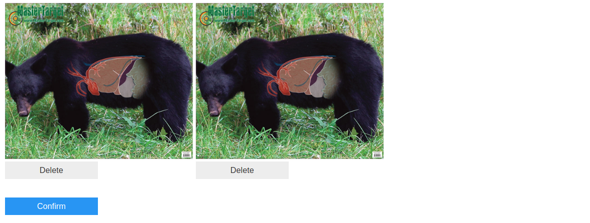
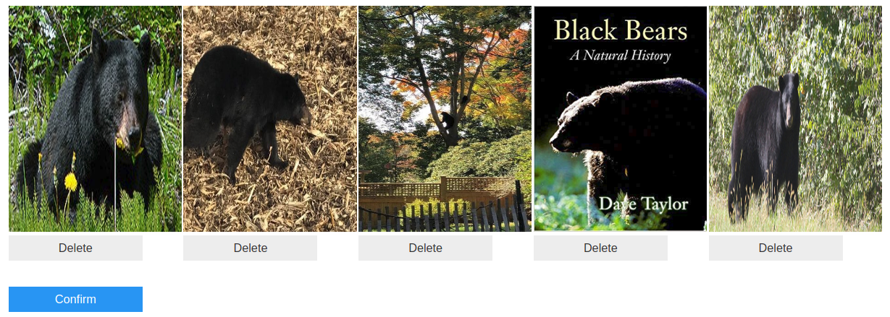
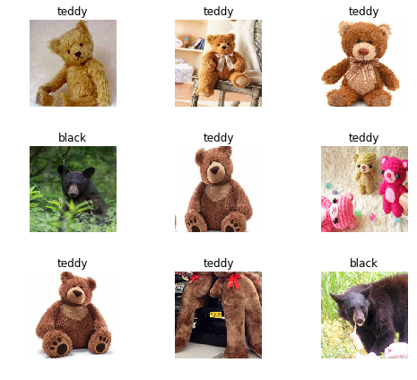
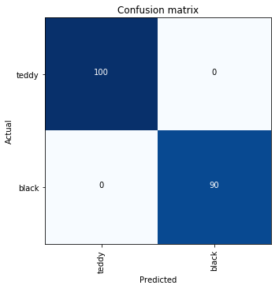

```python
from DatasetScraper.scraper import scrape
from DatasetScraper.curator import Curator
```


```python
# google search terms
search_terms = [
    'teddy bears',
    'black bears'
]

# name of the classes
classes = [
    'teddy',
    'black'
]
```


```python
# scrape the images
for i,search in enumerate(search_terms):
    print("Fetching images of", classes[i])
    
    # pass in path to chromedriver
    scrape('/bin/chromedriver', search, classes[i])
    print("Done\n")
```

    Fetching images of teddy
    [*] Opening browser
    [*] Scrolling to generate images
    [*] Scraping
    [*] Validating Files

    cannot identify image file '/home/bill/DatasetScraper/teddy/teddy_611.png'
    cannot identify image file '/home/bill/DatasetScraper/teddy/teddy_198.jpg'
    cannot identify image file '/home/bill/DatasetScraper/teddy/teddy_625.png'
    Done
    
    Fetching images of black
    [*] Opening browser
    [*] Scrolling to generate images
    [*] Scraping
    [*] Validating Files

    cannot identify image file '/home/bill/DatasetScraper/black/black_614.jpg'
    Done
    

```python
# time to curate
curator = Curator(path='teddy')
```


```python
# find images which appear similar (from the eyes of a neural network)
curator.duplicate_detection()
```




```python
# find images which appear different (from the eyes of a neural network)
curator.garbage_detection()
```



```python
curator = Curator('black')
```


```python
curator.duplicate_detection()
```





```python
curator.garbage_detection()
```




```python
# Now for some fastai
from fastai import *
from fastai.vision import *
from pathlib import Path
```


```python
# We got our pictures
fnames = get_image_files('teddy')+get_image_files('black')
fnames[:5]
```


    [PosixPath('teddy/teddy_405.jpg'),
     PosixPath('teddy/teddy_30.jpg'),
     PosixPath('teddy/teddy_615.jpg'),
     PosixPath('teddy/teddy_428.jpg'),
     PosixPath('teddy/teddy_134.jpeg')]


```python
# create an image data bunch
data = ImageDataBunch.from_name_func('./', fnames, 
        ds_tfms=get_transforms(), size=224, 
        label_func = lambda x: 'teddy' if 'teddy' in str(x) else 'black').normalize(imagenet_stats)
```


```python
# show a sample of the data
data.show_batch(rows=3, figsize=(7,6))
```





```python
# create a cnn based on pretrained resnet34 with new head which we'll learn
learn = create_cnn(data, models.resnet34, metrics=error_rate)
```


```python
# fit one cycle learning rate schedule over 4 epochs
learn.fit_one_cycle(4)
```

    Total time: 01:04
    epoch  train_loss  valid_loss  error_rate
    1      0.300328    0.001419    0.000000    (00:19)
    2      0.137598    0.000310    0.000000    (00:14)
    3      0.084673    0.000323    0.000000    (00:15)
    4      0.056782    0.000348    0.000000    (00:15)
    


```python
# How'd we do on the validation data?
interp = ClassificationInterpretation.from_learner(learn)
interp.plot_confusion_matrix(figsize=(5,5))
```





```python

```
