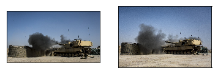
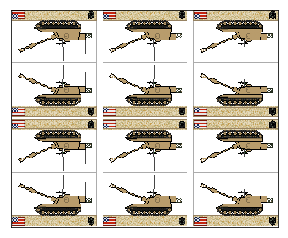

```python
from DatasetScraper.scraper import scrape
from DatasetScraper.curator import Curator
import os
```


```python
search_terms = [
    'M109A6 Paladin',
    'M1 Abrams'
]

classes = [
    'paladin',
    'abrams'
]
```


```python
os.listdir()
```


    ['DatasetScraper', 'Tutuorial.ipynb']


```python
for i,search in enumerate(search_terms):
    print("Fetching images of", classes[i])
    
    # pass in path to chromedriver
    scrape('/bin/chromedriver', search, classes[i])
    print("Done\n")
```

    Fetching images of paladin
    [*] Opening browser
    [*] Scrolling to generate images
    [*] Scraping
    [*] Renaming files
    Done
    
    Fetching images of abrams
    [*] Opening browser
    [*] Scrolling to generate images
    [*] Scraping
    [*] Renaming files
    Done
    


```python
os.listdir()
```


    ['DatasetScraper',
     'paladin',
     'abrams',
     'Tutuorial.ipynb']


```python
os.listdir('paladin')[:5]
```


    ['paladin_38.jpg',
     'paladin_224.jpg',
     'paladin_233.jpg',
     'paladin_259.jpg',
     'paladin_123.jpg']


```python
curator = Curator('paladin')
```


```python
curator.duplicate_detection()
```





    1. Add left image to purge list
    2. Add right image to purge list
    3. Add both images to purge list
    4. Skip
    5. Done with dup detection
    5


```python
curator.garbage_detection()
```





    1. Add image to purge list
    2. Skip
    3. Done with garbage detection
    3


```python
curator.purge()
```


```python

```
