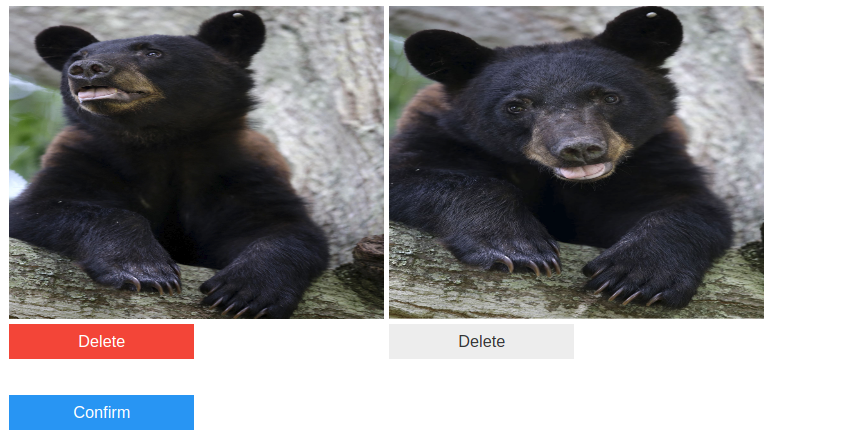

```python
from DatasetScraper.scraper import scrape
from DatasetScraper.curator import Curator
import os
```


```python
# google search terms
search_terms = [
    'teddy bears',
    'black bears'
]

# name of the classes
classes = [
    'teddy',
    'black'
]
```


```python
# scrape the images
for i,search in enumerate(search_terms):
    print("Fetching images of", classes[i])
    
    # pass in path to chromedriver
    scrape('/bin/chromedriver', search, classes[i])
    print("Done\n")
```

    Fetching images of teddy
    [*] Opening browser
    [*] Scrolling to generate images
    [*] Scraping
    [*] Validating Files    
    Done
    
    Fetching images of black
    [*] Opening browser
    [*] Scrolling to generate images
    [*] Scraping
    [*] Validating Files
    Done
    


```python
# time to curate

# get paths to teddy bear images
imgs = [os.path.join('teddy', file_name) for file_name in os.listdir('teddy')]

# create the Curator
curator = Curator(img_paths=imgs)
```


```python
# find images which appear similar (from the eyes of a neural network)
curator.duplicate_detection()
```


```python
# find images which appear different (from the eyes of a neural network)
curator.garbage_detection()
```


```python
# get paths to black bear images
imgs = [os.path.join('black', file_name) for file_name in os.listdir('black')]

# create the Curator
curator = Curator(img_paths=imgs)
```


```python
curator.duplicate_detection()
```





```python
curator.garbage_detection()
```


```python

```
